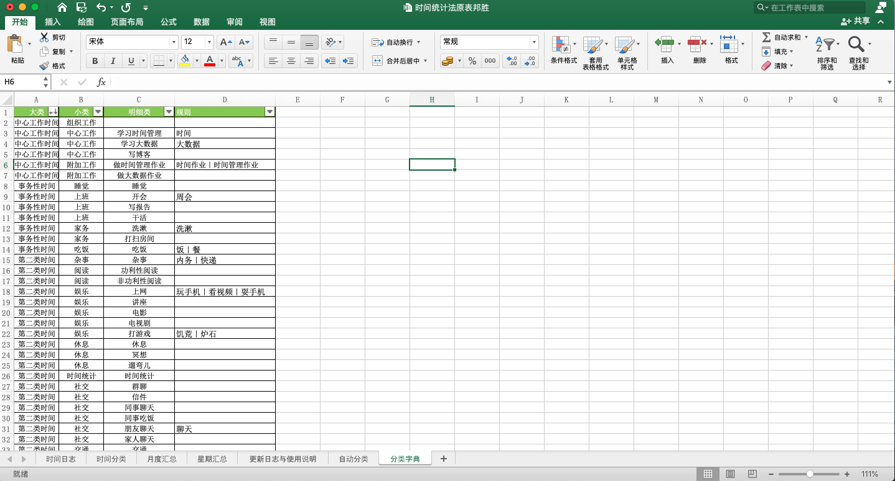

# time_auto_classification
# 自动设置时间分类脚本

### 脚本功能 

通过字典，匹配时间分类的大类、小类和明细类

### 使用环境准备

#### 1. python环境准备

**Windows安装python**

点击[下载地址](https://www.python.org/downloads/release/python-382/)
进入python官方网站，拉到最下方选择`Windows x86-64 executable installer` 进行下载


下载完成后，一直点击下一步即可完成安装

打开程序开始菜单，输入`cmd`


在命令提示符中输入python


回车后出现以下界面即安装成功


输入`exit()`后回车即可退出页面

在命令提示符（cmd界面）中输入以下命令安装依赖

```shell
pip install pandas
pip install openpyxl
```
至此python环境设置完毕

如有疑问参照：https://www.jianshu.com/p/9e776628d67c

**Mac安装python**

打开终端（terminal）输入命令

```shell
brew install python3
```


安装完成后，输入` python3`,若出现下图则安装成功


输入`exit()`后回车即可退出页面

**!!!! 注意Mac 本身自带python2，我们使用的是python3**

在终端（terminal）中输入以下命令安装依赖

```shell
pip3 install pandas
pip3 install openpyxl
```

至此Mac环境设置完毕

如有疑问参照：https://www.cnblogs.com/meng1314-shuai/p/9031686.html

#### 2. 时间日志文件

在原表中加入两个sheet，分类字典和自动分类两页


2.1 分类字典

分类字典一共有四个表头，大类、小类、明细类、规则

其中，大类小类和明细类**必须和时间分类sheet中的分类保持一致**

规则中填写该明细类的关键字，多个关键字用`|`分隔（会正则表达式的使用者可以在规则一栏中填写正则表达式），如下图



2.2 自动分类

自动分类一共有四个表头，数据，大类、小类，明细类。

数据表示，需要被自动分类的数据

分类完成后，大类，小类，明细类会自动填充


### 脚本使用原理

通过"分类字典"去识别分类，然后在"自动分类"中填充分类，先试用字典中的"规则"列对分类进行匹配，再使用"明细类"列进行匹配，即，"明细类"和"规则"都能被用于识别。

### 脚本运行

Windows
 
```shell 
python 文件路径/main.py 文件路径/时间记录文件.xlsx 
```

Mac

```shell 
python3 文件路径/main.py 文件路径/时间记录文件.xlsx 
```

实际使用过程中，脚本文件和excel文件可以直接拖拽到命令框中